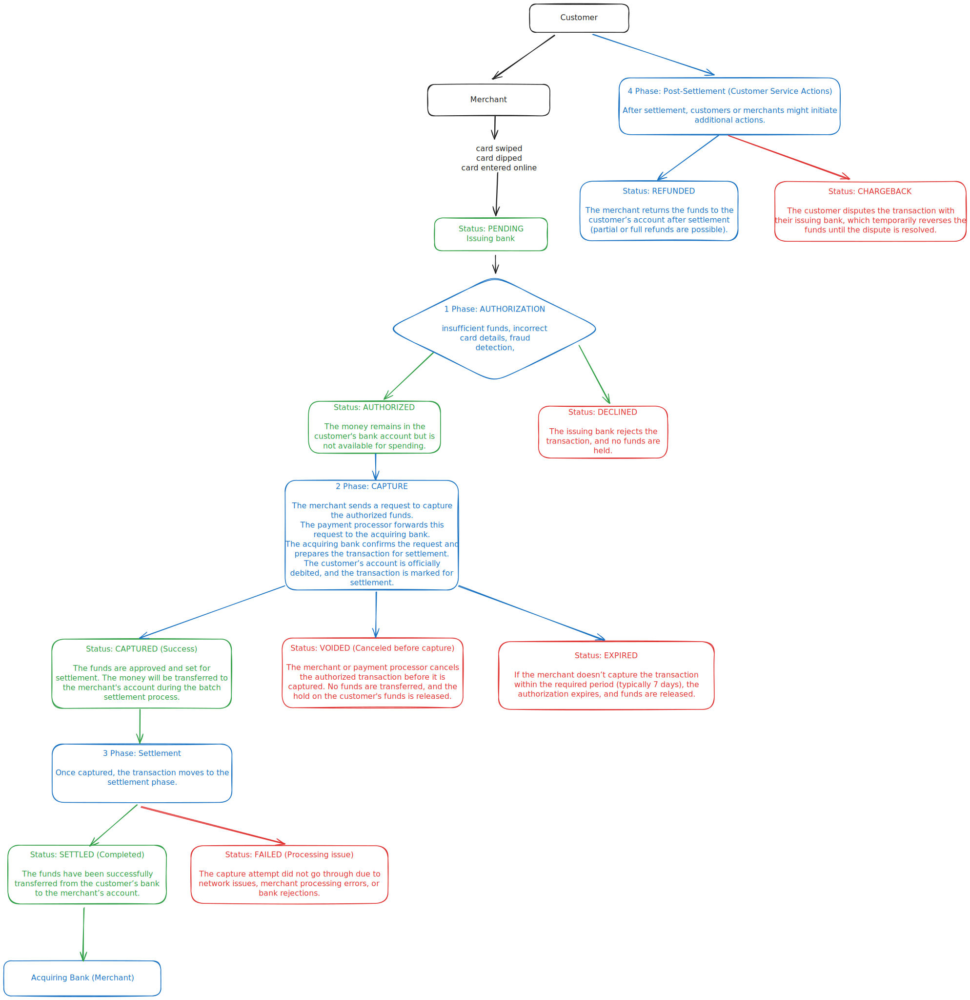

# Fintech basic

## Terms

**Payment Processor**

A payment processor is a company that handles transactions between merchants, acquiring banks, and card networks (Visa, Mastercard, etc.). It facilitates the movement of funds and ensures that payments are securely processed.

A payment processor is the middleman that securely moves transaction data between the merchant, acquiring bank, card networks, and issuing bank.

The payment processor is responsible for:

- Transmitting transaction data between the merchant, acquiring bank, and card network
- Encrypting sensitive payment information to prevent fraud
- Handling authorization requests from card issuers
- Ensuring compliance with security standards (PCI DSS)
- Managing refunds, voids, and chargebacks

Examples of Payment Processors: Stripe, PayPal, Square, Adyen, Worldpay, Fiserv, Authorize.net

**Refund**

A refund is when a merchant voluntarily returns the transaction amount to the customer, typically due to a return, dissatisfaction, or an issue with the product/service.

**Chargeback**

A chargeback is when a customer files a dispute with their issuing bank, asking them to forcibly reverse the transaction.
Merchants should prioritize refunds to avoid chargebacks whenever possible.

**Gross Payments**

Gross Income/Revenue: The total amount of money earned before deductions like taxes, expenses, or costs.

### Resources

[Interchange in 1,000 words - Matt Brown's Notes](https://notes.mtb.xyz/p/interchange-in-1000-words)

[Payfac in 1,000 words - Matt Brown's Notes](https://notes.mtb.xyz/p/payfac-1000-words)
